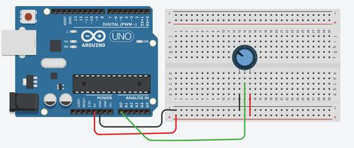
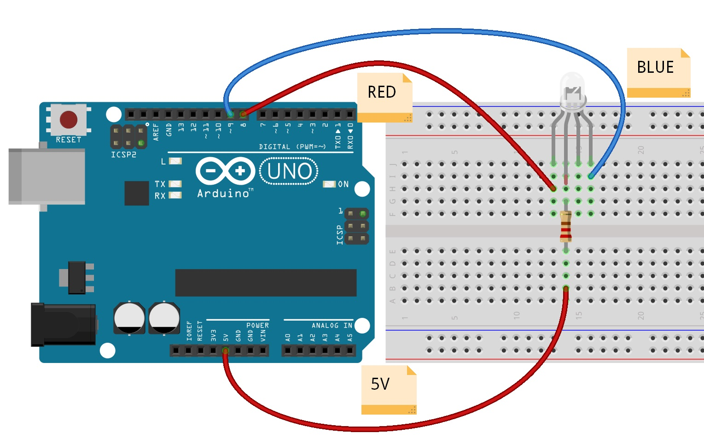

[<<<< Manu >>>>](../README.md)

# שיעור שני - פוטנציומר
&nbsp;&nbsp;
## המעגל שנבנה:
&nbsp;


<br><br>

## פקודות שימושיות: 

```cpp


int AnalogPin = 0;

 

Serial.begin(9600);

 

int sensorValue = analogRead(AnalogPin); 
 

 

Serial.println(sensorValue); 

 

delay(10);   

 
```
<br><br><br><br><br><br><br><br><br><br><br><br>


## הקוד: 


```cpp

int AnalogPin = 0;
int DelayTime = 10; // 10 milliseconds

void setup() 
{
  Serial.begin(9600);     // init. serial com. at 9600 bits per sec.
}

void loop() 
{
  int sensorValue = analogRead(AnalogPin);   // read analog: 0 to 1023 (10 bits)
  
  Serial.println(sensorValue);   // print out the value you read
  delay(DelayTime);                
}

```

<br><br><br>
<br><br><br>
<br><br><br>


## צירוף הלד משעור קודם



