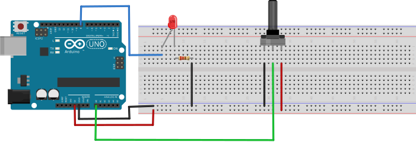
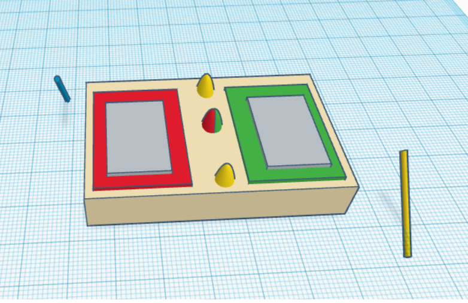
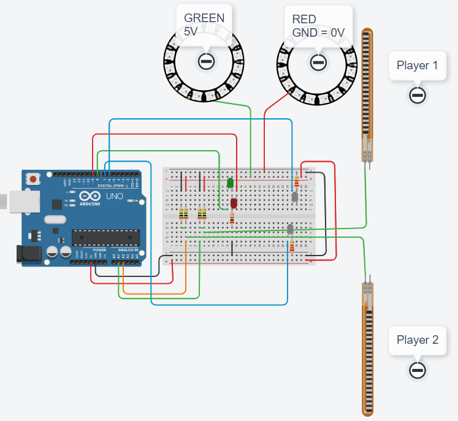

[<<<< Menu >>>>](../README.md)

# שיעור שני - פוטנציומטר - דגימה אנלוגית - ערוץ סריאלי
&nbsp;&nbsp;
### המעגל שנבנה:
&nbsp;


<br><br>

### פקודות שימושיות: 

```cpp


int AnalogPin = 0;
 
Serial.begin(9600);
 
int sensorValue = analogRead(AnalogPin); 
 
Serial.println(sensorValue); 

delay(10);   

 
```
<br><br><br><br><br><br><br><br><br><br><br><br>


### הקוד: 


```cpp

int AnalogPin = 0;
int DelayTime = 10; // 10 milliseconds

void setup() 
{
  Serial.begin(9600);     // init. serial com. at 9600 bits per sec.
}

void loop() 
{
  int sensorValue = analogRead(AnalogPin);   // read analog: 0 to 1023 (10 bits)
  
  Serial.println(sensorValue);   // print out the value you read
  delay(DelayTime);                
}

```

<br><br><br>
<br><br><br>
<br><br><br>


### צירוף הלד משעור קודם




<br><br><br><br><br><br>

# בניית המשחק

### מבנה המשחק:




### המעגל של המקלות והמשטחים:


### המעגל של הלדים - ירוק \ אדום:


### המעגל של הלדים - מי ניצח:


### המעגל המלא:



<br><br><br>

### הקוד:

```cpp

int Player_1_V = 0;                      // Player 1 voltage reading
int Player_2_V = 0;                      // Player 2 voltage reading
int Led_Color = 0;                       // Current LED color (1=Green, 2=Red)
int GREEN = 1;                           // Green color constant connected to GND = 0V
int RED = 2;                             // Red color constant connected to 5V
int Someone_Won = 0;                     // Winner indicator (0=none, 1=P1, 2=P2)
int LedPin_Color_Green = 8;              // Pin for green color LED
int LedPin_Color_Red = 9;                // Pin for red color LED
int LedPin_Player_1 = 6;                 // Pin for Player 1 indicator LED
int LedPin_Player_2 = 7;                 // Pin for Player 2 indicator LED

void setup() 
{
  // Initialize random seed from analog noise
  randomSeed(analogRead(0) + analogRead(5));
  pinMode(LedPin_Color_Green, OUTPUT);   // Set green LED pin as output
  pinMode(LedPin_Color_Red, OUTPUT);     // Set red LED pin as output
  pinMode(LedPin_Player_1, OUTPUT);      // Set Player 1 LED pin as output
  pinMode(LedPin_Player_2, OUTPUT);      // Set Player 2 LED pin as output
  Serial.begin(9600);                    // Start serial communication at 9600 baud
}

void loop() 
{
  digitalWrite(LedPin_Color_Green, LOW); // Turn off green LED
  digitalWrite(LedPin_Color_Red, LOW);   // Turn off red LED
  digitalWrite(LedPin_Player_1, LOW);    // Turn off Player 1 LED
  digitalWrite(LedPin_Player_2, LOW);    // Turn off Player 2 LED
  delay(2000);                           // Wait 2 seconds before new round
  Led_Color = random(1, 3);              // Randomly select target color (1 or 2)
  
  if (Led_Color == GREEN)                // If green was selected
  {
    Serial.println("Green LED on");      // Print to serial monitor
    digitalWrite(LedPin_Color_Green, HIGH); // Turn on green LED
  } 
  else                                   // If red was selected
  {
    Serial.println("Red LED on");        // Print to serial monitor
    digitalWrite(LedPin_Color_Red, HIGH); // Turn on red LED
  }
  
  Someone_Won = 0;                       // Reset winner status
  while (Someone_Won == 0)               // Loop until someone wins
  {
    Player_1_V = analogRead(A1);         // Read Player 1 analog input voltage
    Player_2_V = analogRead(A2);         // Read Player 2 analog input voltage
    Serial.print("Player 1 V = ");       // Print label
    Serial.print(Player_1_V);            // Print Player 1 voltage value
    Serial.print("; \t Player 2 V = ");  // Print separator and label
    Serial.println(Player_2_V);          // Print Player 2 voltage value
    
    // Testing Player 1 if he is hitting and if he is correct:
    // Check if P1 touched green target (GND = 0V)
    if (Player_1_V < 400)
    {
      if (Led_Color == GREEN)            // If green is the correct target
      {
        Someone_Won = 1;                 // Player 1 wins
      } 
      else                               // If green is wrong target
      {
        Someone_Won = 2;                 // Player 2 wins (P1 made mistake)
      }
    }
    
    // Check if P1 touched red target (5V)
    if (Player_1_V > 600)
    {
      if (Led_Color == RED)              // If red is the correct target
      {
        Someone_Won = 1;                 // Player 1 wins
      } 
      else                               // If red is wrong target
      {
        Someone_Won = 2;                 // Player 2 wins (P1 made mistake)
      }
    }
    
    // Testing Player 2 if he is touching and if he is correct:
    // Check if P2 touched green target (GND = 0V)
    if (Player_2_V < 400)
    {
      if (Led_Color == GREEN)            // If green is the correct target
      {
        Someone_Won = 2;                 // Player 2 wins
      } 
      else                               // If green is wrong target
      {
        Someone_Won = 1;                 // Player 1 wins (P2 made mistake)
      }
    }
    
    // Check if P2 touched red target (5V)
    if (Player_2_V > 600)
    {
      if (Led_Color == RED)              // If red is the correct target
      {
        Someone_Won = 2;                 // Player 2 wins
      } 
      else                               // If red is wrong target
      {
        Someone_Won = 1;                 // Player 1 wins (P2 made mistake)
      }
    }
  }
  
  if (Someone_Won == 1)                  // If Player 1 won the round
  {
    // Print winner message
    Serial.println("********* Player ---- 1 ---- WON *********");
    digitalWrite(LedPin_Player_1, HIGH); // Light up Player 1 LED
  }
  
  if (Someone_Won == 2)                  // If Player 2 won the round
  {
    // Print winner message
    Serial.println("********* Player ---- 2 ---- WON *********");
    digitalWrite(LedPin_Player_2, HIGH); // Light up Player 2 LED
  }
  
  // Display winner for 2 seconds before next round
  delay(2000);
}
```


