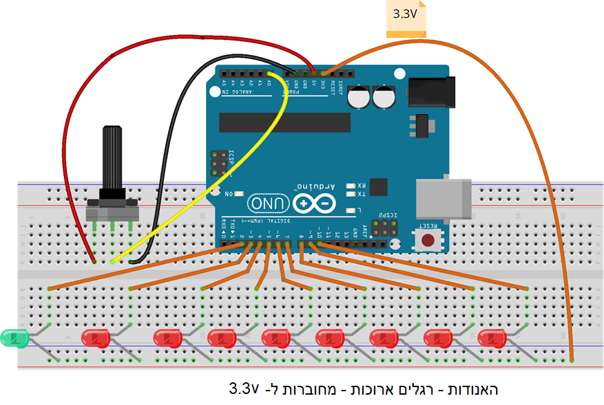

[<<<< Menu >>>>](../README.md)

# שיעור 5.5 - חנוכה
&nbsp;&nbsp;
### מעגל החנוכייה:
&nbsp;


<br><br>

### הקוד: 


```cpp

int ShamashPin = 2;     // Shamash pin
int FirstCandlePin = 3; // First candle pin
int CandlesCount = 8;   // Total number of candles (excluding the Shamash)

void setup() {
  Serial.begin(9600); // Initialize serial communication
  for (int i = 0; i < CandlesCount; i++) {
    pinMode(FirstCandlePin + i, OUTPUT); // Set candle pins as OUTPUT
  }
  pinMode(ShamashPin, OUTPUT); // Set Shamash pin as OUTPUT
}

void loop() {
  int sensorValue = analogRead(A0); // Read value from potentiometer
  // Map sensor value to number of candles
  int numOfCandles = map(sensorValue, 0, 1024, 1, CandlesCount + 1); 
  digitalWrite(ShamashPin, LOW); // Turn on the Shamash (LOW = ON)
  for (int i = 0; i < CandlesCount; i++) {
    if (i < numOfCandles) {
      digitalWrite(FirstCandlePin + i, LOW); // Turn on candle
    }
    else{ 
      digitalWrite(FirstCandlePin + i, HIGH); // Turn off candle
    }
  }
  Serial.print("Candles Lit: "); 
  Serial.println(numOfCandles); // Print the number of lit candles
  delay(100); // Small delay for stability
}


```
