[<<<< Menu >>>>](../README.md)

# שיעור רביעי - Tinkercad - רכיב אולטראסוני
&nbsp;&nbsp;

# מתחילים לעבוד עם [Tinkercad](https://www.tinkercad.com/):

  

### להתחלת מעגל חדש יש ללחוץ על +New:
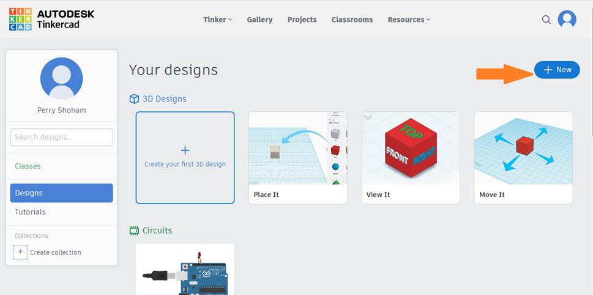

### לבחור Circuit:
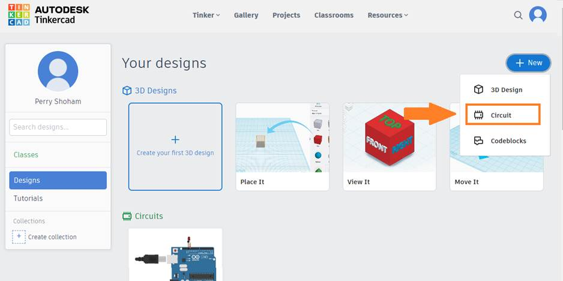

### לחיצה על הארדואינו אונו:

### לחיצה על משטח העבודה כדי להניח את הארדואינו:
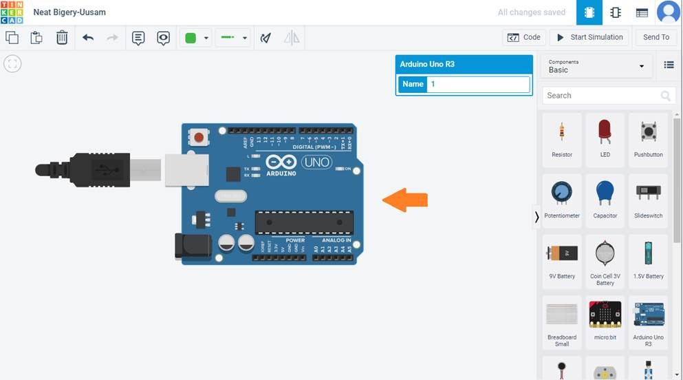

### באופן דומה ללחוץ על ה-Breadboard Small ועל הלוח:
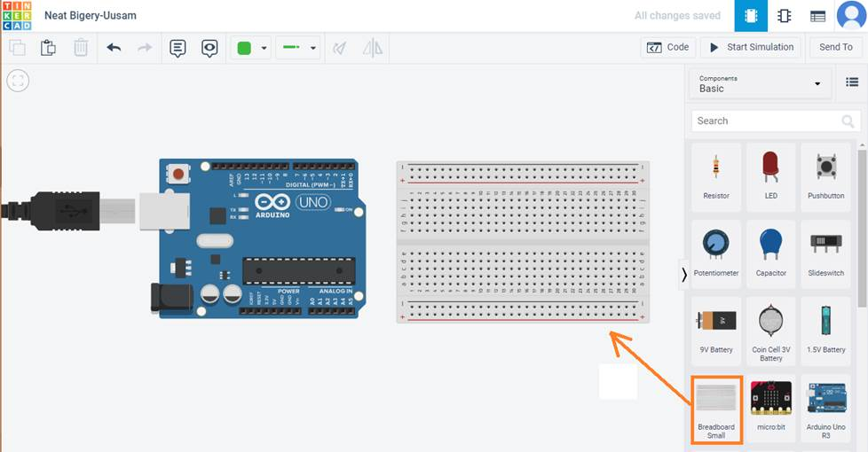

### כדי לחבר חוט מהאדמה (GND) אל המטריצה, נלחץ בנקודות הבאות:
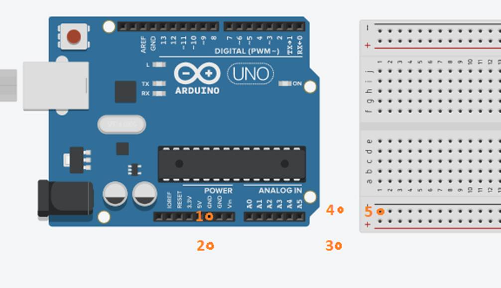

### אפשר וכדאי לשנות את החוט לשחור (עבור GND):
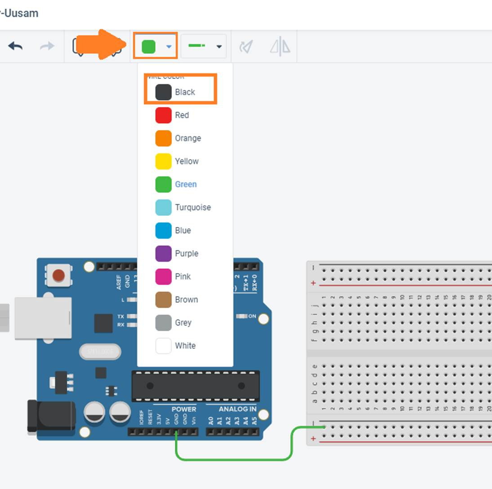

### באופן דומה מחברים את ה-5V בצבע אדום:
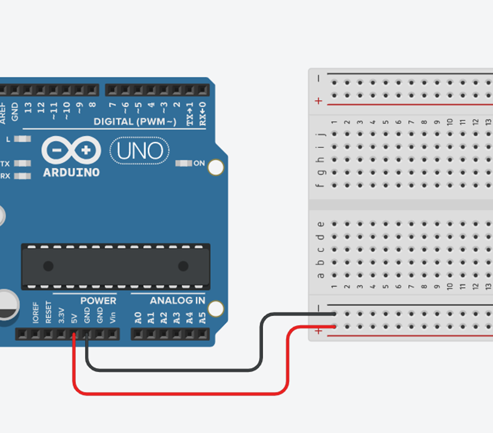

### מוסיפים לד ונגד:
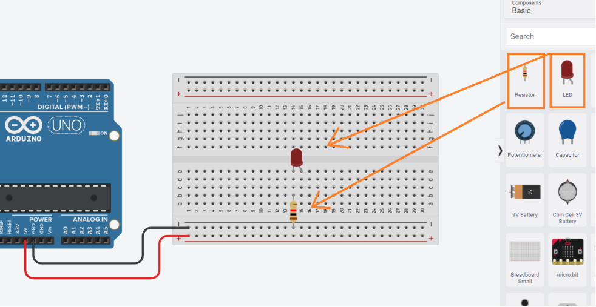

### לוחצים על הנגד מזינים את ערכו – 220 ובוחרים אום Ω:
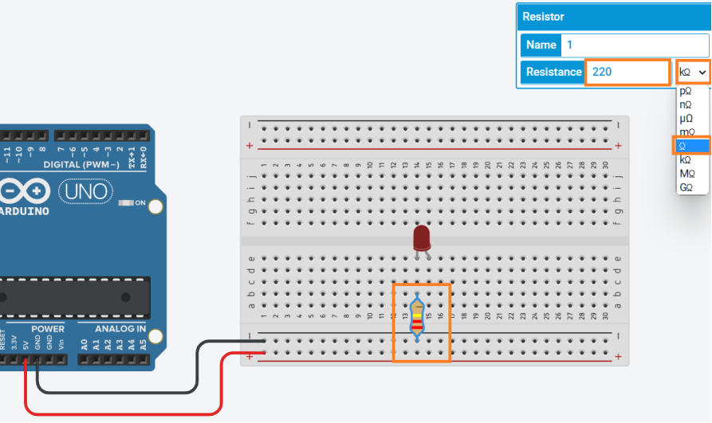

### כדי לשנות את הקוד יש ללחוץ על Code:
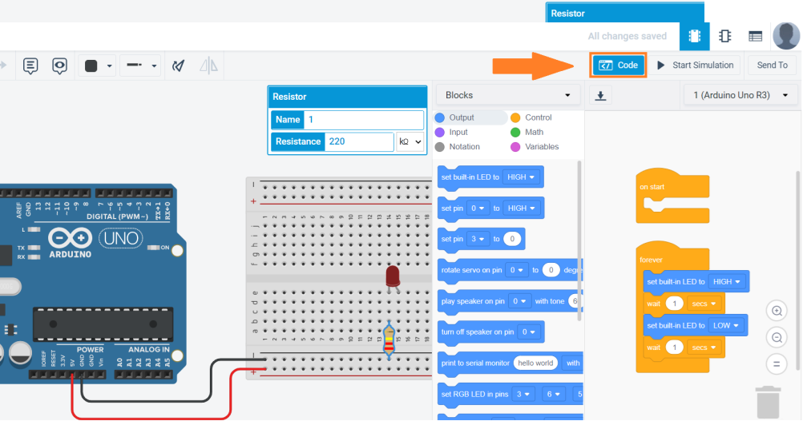

### הקוד שמופיע בהתחלה בתוך ה-forever שהוא ה-loop מהבהב את הלד שעל הכרטיס – פין 13. אפשר לגרור אותו לפח:
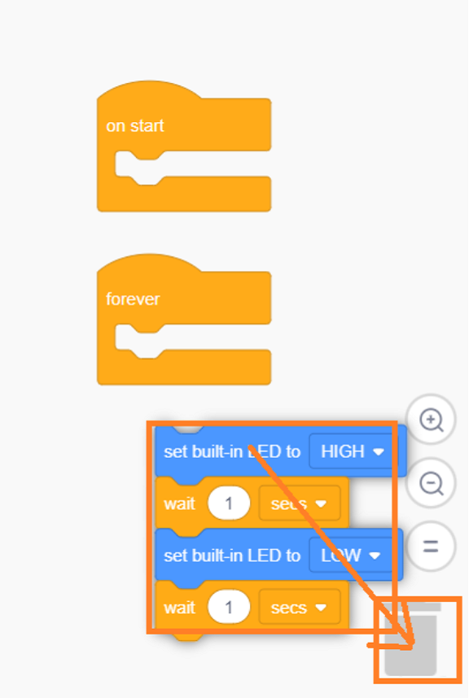

### ולבנות קוד שממתג את רגל מספר 8 – כמו שעשינו בשיעור הראשון:
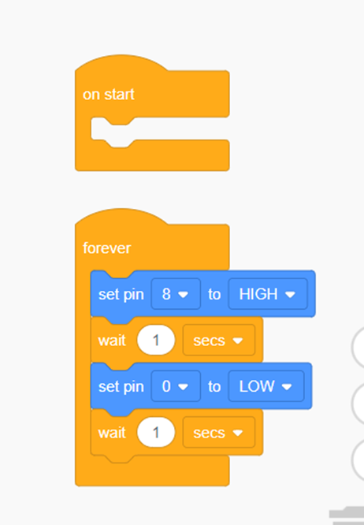

### נחבר את רגל 8 לאנודה ונריץ בלחיצה על כפתור Start Simulation:
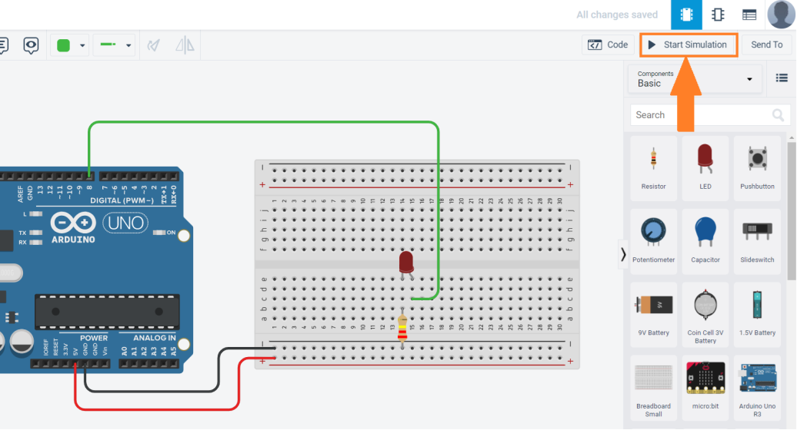

### כאשר רוצים להעתיק קוד לסביבת הארדואינו, יש לפתוח את הקוד ולבחור ב-Blocks את Blocks + Code אז ניתן להעתיק את הקוד מימין:
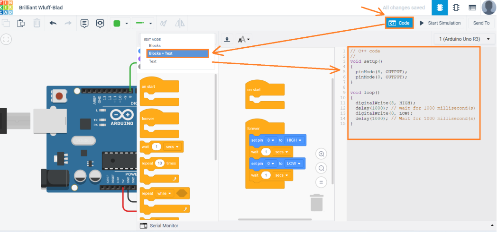

  
  
  
  
### מדידת מרחק אולטראסוני עם חיישן HC-SR04:

#### המטרה: בניית מעגל המודד מרחק, אם המרחק קטן מ-20c”m  ידלק לד ! 

#### בשלב הראשון נבנה את המעגל ב-Tinkercad

#### שימו לב לבחור את הרכיב עם 4 פינים ולא 3 – זה הרכיב שיש לנו הוא נמצא ב-All:

### [נסו לחפש את הרכיב... אבל אם לא תמצאו לחצו כאן :)](data/Find_4_legs_US_in_Tinkercad.gif)

### וכמובן את הארדואינו והמטריצה של החיבורים:

### מחברים את האדמה וה-5V  ובוחרים 2 פינים דיגיטלים (2-13) שיהיו ה-Trig  וה-ECHO ומחברים אותם.
### לכתיבת הקוד יש להגדיר משתנה בשם "מרחק" – distance או בקיצור dist, ולקרא את המרחק מהרכיב באופן הבא:

### הדפיסו את המרחק הנמדד, בדקו האם הוא מתחת 20c”m - הדליקו או כבו את הלד הבנוי על הארדואינו בהתאם למרחק. 
### את כל הקוד שימו בבלוק ב-forever  שהוא ה-loop.
### כאשר מריצים את הסימולציה אפשר לבחור ברכיב האולטראסוני, לקרב או להרחיק ממנו עיגול ולבדוק את תקינות המעגל והקוד.
### כשהכל עובד עוברים לבניית המעגל והעתקת הקוד כפי שעשינו במעגל הקודם. 

### אם אתם צריכים עזרה, תגללו למטה...

        
        
        
        
        
        

### עזרה ראשונה - הינה הבלוקים הנדרשים:

### אם אתם צריכים עזרה נוספת תמשיכו לגלול....

        
        
        
        
        
        

### המעגל למדידת מרחק ב- Tinkercad(צריך להוסיף לד ונגד):

### והקוד שיש להכניס:

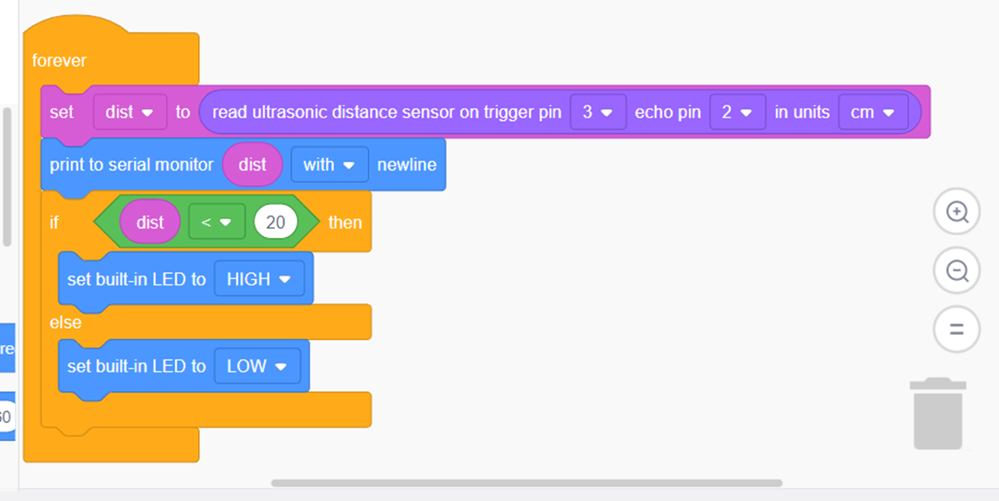

