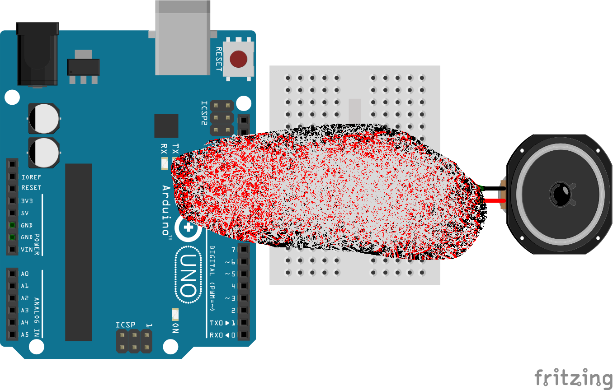
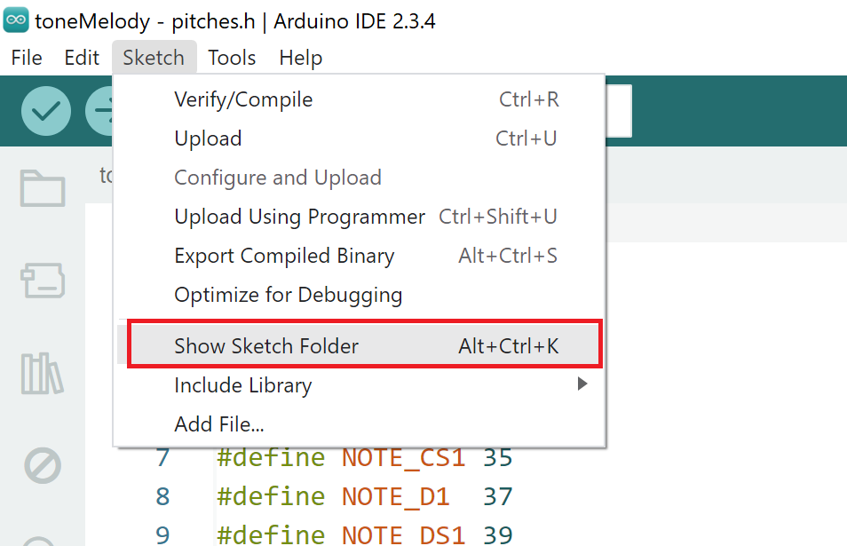

[<<<< Menu >>>>](../README.md)

# שיעור חמישי - כפתורים והפקת צלילים


<br>


### המעגל שנבנה:


###  הקוד:

```cpp

const int buttonPin = 2;  // Pin connected to the button
const int ledPin = 13;    // Pin connected to the LED

int ledState = 0;           // LED state: 0 = OFF, 1 = ON
int lastButtonState = HIGH; // Last button state (initially HIGH due to pull-up)
int currentButtonState;

void setup() {
  pinMode(buttonPin, INPUT_PULLUP); // Configure the pin as input with pull-up. 
  pinMode(ledPin, OUTPUT);          // Configure the LED pin as output.
  digitalWrite(ledPin, LOW);        // Turn LED off.
}

void loop() {
  // Read the current state of the button
  currentButtonState = digitalRead(buttonPin);

  // Check if the button state changed from HIGH to LOW
  if (currentButtonState == LOW && lastButtonState == HIGH) {
    delay(50);    // Debounce using delay
    if (digitalRead(buttonPin) == LOW) { // Ensure stable state after delay
      ledState = 1 - ledState; // Toggle between 0 and 1        
      digitalWrite(ledPin, ledState);
    }
  }
  // Save the current button state for the next iteration
  lastButtonState = currentButtonState;
}

```
### נסו לשנות את הקוד כך שהפעולה תתבצע בשחרור הכפתור ולא בלחיצה (on release).

<br><br><br>
# 
<br><br><br><br>
### מעגל נגן צלילים:

### הקוד:

```cpp

#include "pitches.h"
#define SEC 1000    // one second in millisecond
#define N_NOTE 8      // number of notes to play

int outPin = 11;       // the speeker output 
int buttonPin = 2;     // the number of the pushbutton pin

int melody[N_NOTE] =        {  NOTE_C4, NOTE_G3, NOTE_G3, NOTE_A3, NOTE_G3,   0,    NOTE_B3,  NOTE_C4 };
int noteDurations[N_NOTE] = {  SEC/4,   SEC/8,    SEC/8,  SEC/4,    SEC/4,  SEC/4,  SEC/4,    SEC/4 };

void setup() 
{
  pinMode(outPin, OUTPUT);
  pinMode(buttonPin, INPUT_PULLUP);    // initialize the pushbutton pin as an input
}

void loop()
{
  if (digitalRead(buttonPin)==LOW)  // wait to button  
  {  
    for (int thisNote = 0; thisNote < N_NOTE; thisNote++)  // for each note:
    {
      tone(outPin, melody[thisNote], noteDurations[thisNote]); // play the note
      delay(noteDurations[thisNote] * 1.30);  //delay note's duration + 30% to put a space between two notes
    }
    delay(1000);
  }  
}

```

### להורדת קובץ pitches.h:
###  [קישור לקובץ - לחצן ימני - שמור בשם](data/pitches.h)
### יש להוסיף את הקובץ לתקיית הפרוייקט. את התיקייה אפשר למצוא כך:


<br><br><br>

### מה עוד אפשר לעשות? 
#### 1. לחבר את גלאי המרחק וליצור פסנתר אל חוטי (באוויר). 
#### 2. להוסיף עוד כפתורים וליצור פסנתר. 
#### 3. לחבר פוטנציומטר שישנה את התדר בהתאם למצבו.
