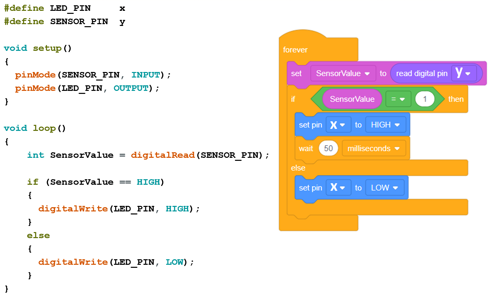

[<<<< Menu >>>>](../README.md)

#  שיעור שישי - גלאי קול ועיבוד אותות 

<br>

### שלב ראשון יש לכוון את סף הגילוי של הרכיב:
<br><br>


### קוד לכיוון סף הגילוי



###  הקוד לזיהוי 2 מחיאות כף:

#### שימו לב לבחור את X, Y
```cpp

#define LED_PIN       X
#define SENSOR_PIN    Y

unsigned long g_Tic;

#define TIC()   g_Tic=millis()
#define TOC()   (millis()-g_Tic)


//                  T0             T2              T0      
//            <------------>    <------>     <------------>
//
//    5V                    #####       #####
//                          |   |       |   |
//                          |   |       |   |
//                          |   |       |   |
//                          |   |       |   |
//    0V    #################   #########   #####################
//
//                          <--->       <--->
//                            T1          T1

#define T0_min    300   // 300 mSec the minimum time before starting and after ending the clapping
#define T1_max    60    // 30  mSec the maximum clap duration

#define T2_min    200   // 200 mSec the minimum  time to the next clap  
#define T2_max    300   // 300 mSec the maximum time to the next clap


void setup() 
{
  pinMode(SENSOR_PIN,  INPUT);
  pinMode(LED_PIN,    OUTPUT);
  Serial.begin(9600); // initialize serial communication
}

// Wait and measure the time until signal != Status
unsigned long GetTimeSignalStatus(int Pin, int Status, int TimeOut = 0)
{
  TIC();
  while(  digitalRead(Pin) == Status )
  {
    if (TimeOut && TOC() >= TimeOut)
    {
      return TimeOut;   // time out
    }
  }
  return TOC();
}

bool IsClapping_OK()
{
  unsigned long t0, t1, t2;
  Serial.println("------- IsClapping_OK starts ------------");
  
  t0 = GetTimeSignalStatus(SENSOR_PIN, LOW);    // Wait and measure the time until signal is HIGH
  
  Serial.print("t0 = ");  Serial.println(t0);   // Print t0
  
  if ( t0 < T0_min)
  {  
    return false;
  }	
  
  delay(T1_max);                        // Ignoring T1_max mSec of signal
  
  t2 = GetTimeSignalStatus(SENSOR_PIN, LOW, T2_max+1);  // wait and measure the time until signal is HIGH

  Serial.print("t2 = ");  Serial.println(t2);   // Print t2

  if ( t2 < T2_min || t2 > T2_max)
  {
    return false; 
  }
  
  delay(T1_max);        // Ignoring T1_max mSec of signal
  
  t0 = GetTimeSignalStatus(SENSOR_PIN, LOW, T0_min);  // Wait and measure the time until signal is HIGH or until TO_min timeout passes

  Serial.print("t0 = ");  Serial.println(t0);   // Print t0
  
  if (t0 < T0_min)
  {
    return false;
  }
  else
  {
    return true;
  }
}


int LedValue = 0;

void loop()
{
  if (IsClapping_OK())
  {
    LedValue = !LedValue;

    if (LedValue)
	{
      Serial.println("Led On!!!");
	}
    else
	{
      Serial.println("Led Off!!!");
    }
    
    digitalWrite(LED_PIN, LedValue);
  }
}

```
### מה עוד אפשר לעשות? 
#### 1. להוסיף לד אדום המעיד לטעות בקוד. 
#### 2. להוסיף סירנה עם טועים ברצף מספר פעמים. 

<br><br><br><br>
<br><br><br><br>

###  הקוד לזיהוי סיסמה של מחיאות כפיים:

```cpp

#define LED_PIN       X
#define SENSOR_PIN    Y

unsigned long g_Tic;

#define TIC()   g_Tic=millis()
#define TOC()   (millis()-g_Tic)


//                  T0            Ta[0]       Ta[1]     Ta[2]   Ta[3]              T0      
//            <------------>    <------>    <------>    <-->    <-->     <------------>
//                                                              
//    5V                    #####       #####       #####   #####   #####
//                          |   |       |   |       |   |   |   |   |   |
//                          |   |       |   |       |   |   |   |   |   |
//                          |   |       |   |       |   |   |   |   |   |
//                          |   |       |   |       |   |   |   |   |   |
//    0V    #################   #########   #########   #####   #####   #####################
//
//                          <--->       <--->       <--->   <--->   <--->
//                            T1          T1          T1      T1      T1

#define T0_min    1000   // 1 Sec the minimum time befoe starting and after ending the clapping
#define T1_max    60    // 60  mSec the maximum clap duration


//++++++++++++++++++++++++  Setup function +++++++++++++++++++++++++++++++++
void setup() 
{
  pinMode(SENSOR_PIN,  INPUT);
  pinMode(LED_PIN,    OUTPUT);
  Serial.begin(9600); // initialize serial communication
}


//++++++++++++++++++++  GetTimeSignalStatus function ++++++++++++++++++++++
unsigned long GetTimeSignalStatus(int Pin, int Status, int TimeOut = 0)
{// wait and measure the time until signal != Status
  TIC();
  while(  digitalRead(Pin) == Status )
  {
    if (TimeOut && TOC() >= TimeOut)
    {
      return TimeOut;   // time out
    }
  }
  return TOC();
}

#define T_TOL    100   // 100 mSec tolerance from time to T_min and T_max

//++++++++++++++++++++  IsOneClap_OK function +++++++++++++++++++++++++
bool IsOneClap_OK(unsigned long a_t, unsigned long a_dt)
{
  bool IsGood = false;
  unsigned long T_max, T_min;
  
  T_min = a_t - a_dt; // Never choose t to be less then T_TOL
  T_max = a_t + a_dt;
  
  unsigned long t = GetTimeSignalStatus(SENSOR_PIN, LOW, T_max+1);  // wait and measure the time until signal is HIGH
  
  Serial.print("T_min = ");     Serial.print(T_min); 
  Serial.print(";   t = ");     Serial.print(t);   
  Serial.print(";   T_max = "); Serial.print(T_max); 
  
  if ( t < T_min )
  {
    Serial.println(";   Too Fast !!!");
    IsGood = false; 
  }
  else if ( t > T_max)
  {
    Serial.println(";   Too Slow !!!");
    IsGood = false; 
  }
  else
  {
    Serial.println(";   Good speed :)");
    IsGood = true; 
  }
  delay(T1_max);
  return IsGood;
}


#define  NUM_OF_CLAPS   5

unsigned long TimeArr [NUM_OF_CLAPS-1] = {600, 600, 300, 300};

//++++++++++++++++++++  IsClapping_OK function +++++++++++++++++++++++++
bool IsClapping_OK()
{
  unsigned long t0, t1, t2;
  Serial.println("------- IsClapping_OK starts ------------");
  
  t0 = GetTimeSignalStatus(SENSOR_PIN, LOW);    // wait and measure the time until signal is HIGH
  
  Serial.print("t0 = ");  Serial.println(t0);   // Print t0
  
  if ( t0 < T0_min) 
    return false;  
  
  delay(T1_max);                        // Ignoring T1_max mSec of signal
  
  
  for (int i=0; i<NUM_OF_CLAPS-1; i++)
  {
    if  ( IsOneClap_OK(TimeArr[i],  T_TOL)==false )
    {
      delay(500);
      return false;
    }
  }
  
  t0 = GetTimeSignalStatus(SENSOR_PIN, LOW, T0_min);  // wait and measure the time until signal is HIGH or until TO_min timeout passes

  Serial.print("t0 = ");  Serial.println(t0);   // Print t0
  
  if (t0 < T0_min)
    return false;
  
  return true;
  
}


int LedValue = 0;

void loop()
{
  
  if (IsClapping_OK())
  {
    LedValue = !LedValue;

    if (LedValue)
      Serial.println("Led On!!!");
    else
      Serial.println("Led Off!!!");

    
    digitalWrite(LED_PIN, LedValue);
  }
}


```