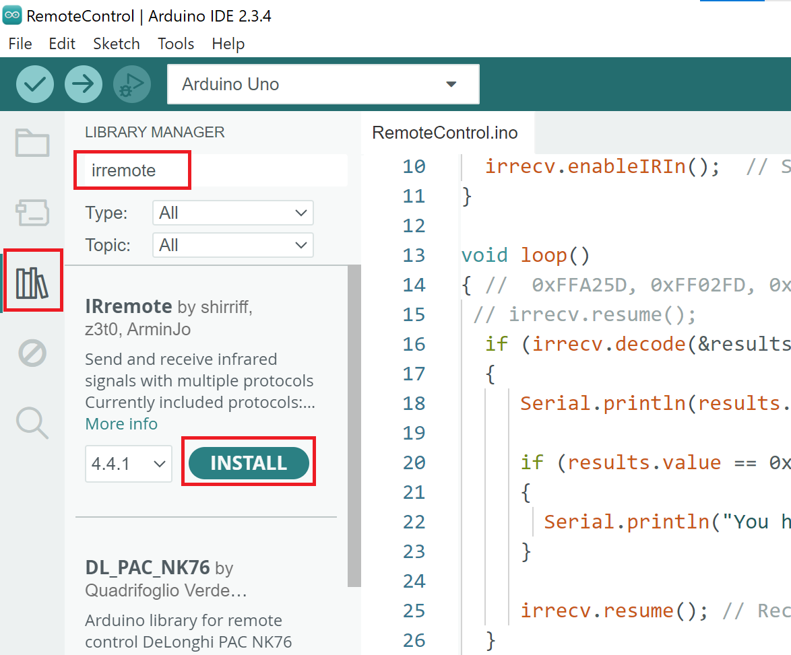

[<<<< Menu >>>>](../README.md)

#  שיעור שביעי - שלט רחוק וגלאי IR 

<br><br>


### כדי להשתמש בשלט רחוק עלינו להוסיף ספריית IRremote.h:

#### - יש לבחור את מנהל הסיפריות בצד שמאל.
#### - לרשום בחיפוש: "IRremote" ולהתקין את הספרייה המתאימה.
#### - ללחוץ על "install" ולהמתין עד לסיום ההתקנה.


<br><br>

### שרטוט ממסמך ה- Specification של לגלאי ה-IR:


<br><br>


### הקוד לזיהוי הסיפרה '1' - יש להוסיף לחצנים נוספים:

```cpp

#include <IRremote.h>

int RECV_PIN = 11; // IR receiver connected to digital pin 11

void setup() {
  Serial.begin(9600);
  Serial.println("IR Receiver Initialized...");

  // Start the IR receiver with LED feedback enabled
  // This makes the built-in LED (pin 13) blink when an IR signal is received
  IrReceiver.begin(RECV_PIN, ENABLE_LED_FEEDBACK);
}

void loop() {
  if (IrReceiver.decode()) { // Check if an IR signal has been received
    unsigned long receivedValue = IrReceiver.decodedIRData.decodedRawData; // Get the raw IR data

    Serial.print("Received: ");
    Serial.println(receivedValue, HEX); // Print the received value in HEX format

    if (receivedValue == 0xFF30CF) { // Check if the button '1' was pressed
      Serial.println("You have pressed '1' :)");
    }

    IrReceiver.resume(); // Prepare to receive the next IR signal
  }
  delay(10); // Short delay to allow stable signal processing
}

```
