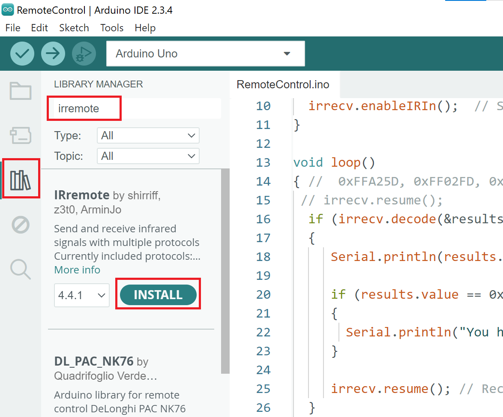

[<<<< Menu >>>>](../README.md)

#  שיעור שביעי - שלט רחוק וגלאי IR 

<br><br>


### כדי להשתמש בשלט רחוק עלינו להוסיף ספריית IRremote.h:

#### - יש לבחור את מנהל הספריות בצד שמאל.
#### - לרשום בחיפוש: "IRremote" ולהתקין את הספרייה המתאימה.
#### - ללחוץ על "install" ולהמתין עד לסיום ההתקנה.


<br><br>

### שרטוט ממסמך ה- Specification של לגלאי ה-IR:


<br><br>


### הקוד לזיהוי הסיפרה '1' - יש להוסיף לחצנים נוספים:

```cpp
#include <IRremote.hpp>

const int RECV_PIN = 11;

void setup() {
    // Start the receiver with LED feedback enabled (true)
    IrReceiver.begin(RECV_PIN, ENABLE_LED_FEEDBACK);
    Serial.begin(9600);
    Serial.println("IR Receiver Initialized...");
}

void loop() {
    if (IrReceiver.decode()) {
        unsigned long receivedValue = IrReceiver.decodedIRData.decodedRawData;

        Serial.print("Received: ");
        Serial.println(receivedValue, HEX);
        // Check if the signal is NOT a repeat (button held down)
        if (!(IrReceiver.decodedIRData.flags & IRDATA_FLAGS_IS_REPEAT)) {
            if (receivedValue == 0xFF30CF) 
            {
                Serial.println("You have pressed '1' :)");
            }
        }
        IrReceiver.resume(); // Prepare for the next signal
    }
    delay(10);
}
```

<br><br>

###  מה עוד אפשר לעשות: 
- להדליק ולכבות לדים.
- סיסמת רצף מספרים.
- פסנתר אלחוטי.

<br><br>

### שימו לב שלנגינה בעזרת השלט יש להשתמש בפונקציה הבאה:

```cpp
void playNote(uint16_t freqHz, uint16_t durMs)
{
  IrReceiver.stopTimer();          // free the timer used by the IR receiver
  tone(BUZZ_PIN, freqHz);          // start note
  delay(durMs);                    // note length (blocks and IR is paused here)
  noTone(BUZZ_PIN);                // stop note
  IrReceiver.restartTimer();       // resume IR receiving
}
```

<br><br>
<br><br>

[<<<< Menu >>>>](../README.md)