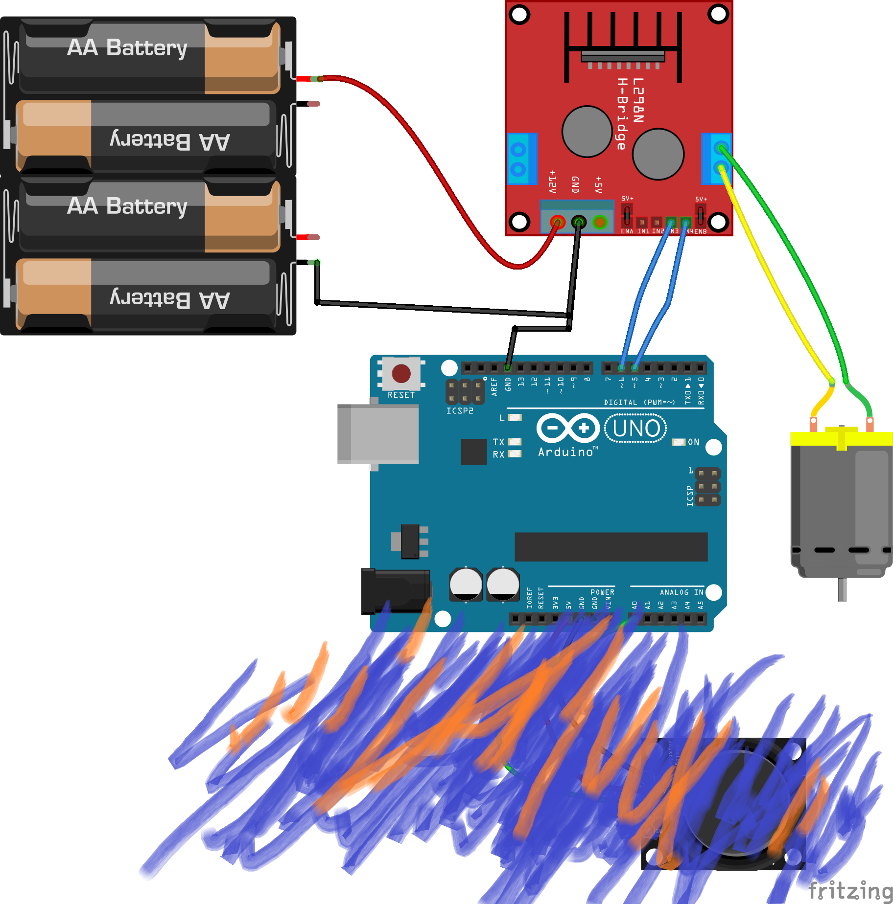

[<<<< Menu >>>>](../README.md)

# שיעור שמיני - מנוע DC וג'ויסטיק 

<br><br>


### המעגל החשמלי:



###  הקוד:

```cpp
#define MAX_SPEED     100     //out of 255
 
int CW_Pin = 5;
int CCW_Pin = 6;
 
void setup() 
{
  Serial.begin(9600); 
  pinMode(CW_Pin, OUTPUT); // CW - Clockwise
  pinMode(CCW_Pin, OUTPUT); // CCW - Counter Clockwise
}
 
void loop() 
{ 
  int xVal = analogRead(A0);
  Serial.print("Anlog = ");Serial.println(xVal);
  int Speed;
  if (  xVal > 600 ) // CW
  {
    analogWrite(CCW_Pin, 0);                    // Turn off the CCW pin
    Speed = map(xVal, 600, 1023, 0, MAX_SPEED);
    analogWrite(CW_Pin, Speed);                 // Turn on the CCW pin
  } 
  else if (  xVal < 420 ) // CCW
  {
    analogWrite(CW_Pin, 0);                   // Turn off the CW pin
    Speed = map(xVal, 420, 0, 0, MAX_SPEED);
    analogWrite(CCW_Pin, Speed);              // Turn on the CCW pin
  } 
  else  
  {
      analogWrite(CW_Pin, 0); // Turn off the CW pin
      analogWrite(CCW_Pin, 0);// Turn off the CCW pin
  }
  delay(20);
}


```
