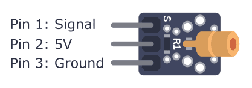
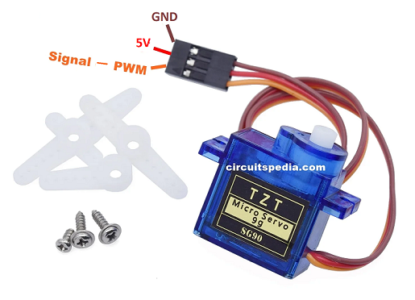

[<<<< Menu >>>>](../README.md)

# שיעור תשיעי - מנוע סרוו, לייזר ובניית רובה גומיות

<br><br>


### היום נבנה כנת נשק עם כוונת ליזר - הינה מבנה הכנה 


<br>

### תואור רגלי רכיב הלייזר: 




<br>

### תואור רגלי רכיב הסרוו: 


<br><br>
### הקוד:


```cpp


#include <Servo.h>

#define MAX_SPEED     255  // Maximum value for PWM signal (0-255 range)
#define MIN_SPEED     50   // Minimum speed for motors to start moving

const int m1_CW_Pin = 5;      // Pin to control clockwise rotation of motor 1
const int m1_CCW_Pin = 6;     // Pin to control counterclockwise rotation of motor 1
const int m2_CW_Pin = 9;      // Pin to control clockwise rotation of motor 2
const int m2_CCW_Pin = 10;    // Pin to control counterclockwise rotation of motor 2

const int Laser_pin  = 4;       // Pin to activate or deactivate the laser module
const int Fire_button_pin = 7;  // Pin connected to the joystick's fire button
const int ServoFire_pin  = 11;  // Pin connected to the servo motor signal
Servo ServoFire; // Create a servo object to control the firing mechanism

#define LASER_TO_FIRE_DELAY 500
#define SERVO_IDEL_ANGLE   0 
#define SERVO_FIRE_ANGLE   90 

void setup() // Initialize pins, motors, and servo 
{
  Serial.begin(9600); 
  // Setting up the motors control pins
  pinMode(m1_CW_Pin, OUTPUT);
  pinMode(m1_CCW_Pin, OUTPUT);
  pinMode(m2_CW_Pin, OUTPUT);
  pinMode(m2_CCW_Pin, OUTPUT);
  pinMode(Laser_pin, OUTPUT);
    
  pinMode(Fire_button_pin, INPUT_PULLUP);
  
  ServoFire.attach(ServoFire_pin); // attaches the servo on pin 11 to the servo object

  TurnLaserOff(); 
  TriggerToIdle();
  StopMotors(); 
}

void StopMotors()
{
  digitalWrite(m1_CW_Pin, LOW);
  digitalWrite(m1_CCW_Pin, LOW);
  digitalWrite(m2_CW_Pin, LOW);
  digitalWrite(m2_CCW_Pin, LOW);  
}

void TurnLaserOn() 
{
  digitalWrite(Laser_pin, HIGH); 
  Serial.println("Laser on...");
}

void TurnLaserOff() 
{
  digitalWrite(Laser_pin, LOW);
  Serial.println("Laser off...");
}

void TriggerToIdle()
{
  ServoFire.write(SERVO_IDEL_ANGLE); 
  Serial.println("Trigger up...");
}
  
void TriggerToFire()
{
  ServoFire.write(SERVO_FIRE_ANGLE); 
  Serial.println("Trigger down (fire)...");
}

void SetMotorSpeed(int cw_pin, int ccw_pin, int speed)
{
  if (speed > 0)
  {
    analogWrite(ccw_pin, 0); // Stop counterclockwise rotation
    analogWrite(cw_pin, speed); // Set clockwise rotation speed
  }
  else
  {
    analogWrite(cw_pin, 0);       // Stop clockwise rotation
    analogWrite(ccw_pin, -speed); // Set counterclockwise rotation speed
  }
}

void MoveMotors() 
{
  // Read the joystick values
  int xVal = analogRead(A0); // Read horizontal joystick position (x-axis)
  int yVal = analogRead(A1); // Read vertical joystick position (y-axis)
  
  Serial.print("xVal (A0) = "); Serial.println(xVal);
  Serial.print("yVal (A1) = "); Serial.println(yVal);
  
  int m1Speed = 0; // Initialize motor 1 speed
  int m2Speed = 0; // Initialize motor 2 speed

  // Determine forward or reverse movement based on y-axis value
  if (yVal > 562)  
  { 
    // Forward movement when the joystick is pushed up (512 + 50 = 562)
    m1Speed = m1Speed + map(yVal, 562, 1023, MIN_SPEED, MAX_SPEED);
    m2Speed = m2Speed + map(yVal, 562, 1023, MIN_SPEED, MAX_SPEED);
  }
  else if (yVal < 462)  
  { 
    // Reverse movement when the joystick is pushed down (512 - 50 = 462)
    m1Speed = m1Speed + map(yVal, 462, 0, -MIN_SPEED, -MAX_SPEED);
    m2Speed = m2Speed + map(yVal, 462, 0, -MIN_SPEED, -MAX_SPEED);
  }
  
  // Determine left or right movement based on x-axis value
  if (xVal > 562) 
  { 
    // Turn right when the joystick is pushed right (512 + 50 = 562)
    m1Speed = m1Speed + map(xVal, 562, 1023, MIN_SPEED, MAX_SPEED);
    m2Speed = m2Speed - map(xVal, 562, 1023, MIN_SPEED, MAX_SPEED);
  }
  else if (xVal < 462)   
  { 
    // Turn left when the joystick is pushed left (512 - 50 = 462)
    m1Speed = m1Speed + map(xVal, 462, 0, -MIN_SPEED, -MAX_SPEED);
    m2Speed = m2Speed - map(xVal, 462, 0, -MIN_SPEED, -MAX_SPEED);
  }

  // Constrain motor speeds to the defined range
  m1Speed = constrain(m1Speed, -MAX_SPEED, MAX_SPEED);    // limit speed from -255 to 255
  m2Speed = constrain(m2Speed, -MAX_SPEED, MAX_SPEED);    // limit speed from -255 to 255

  // Set the speeds for both motors using the SetMotorSpeed function
  SetMotorSpeed(m1_CW_Pin, m1_CCW_Pin, m1Speed);
  SetMotorSpeed(m2_CW_Pin, m2_CCW_Pin, m2Speed);
}

void loop() 
{ 
  TriggerToIdle();
  TurnLaserOff();
 
  if (!digitalRead(Fire_button_pin)) // if trigger pressed
  {
    StopMotors();
    TurnLaserOn();
    
    delay(LASER_TO_FIRE_DELAY);   // Brief delay before fire
    
    while(!digitalRead(Fire_button_pin))  // while fire key is down 
    {
      TriggerToFire();
      delay(20); 
    }
  }
  else    // else = fire button up: move the car
  {
    MoveMotors();  
  }
  delay(20);
}


```
