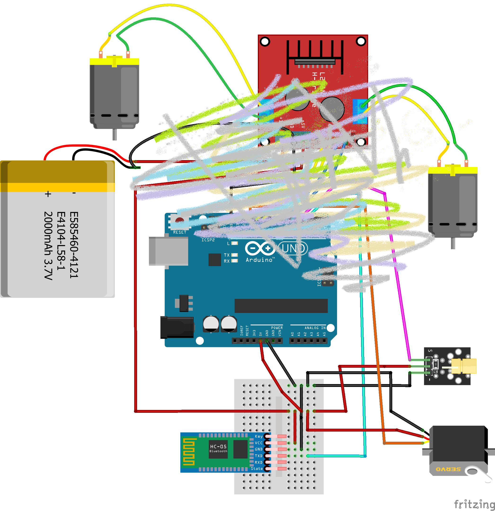
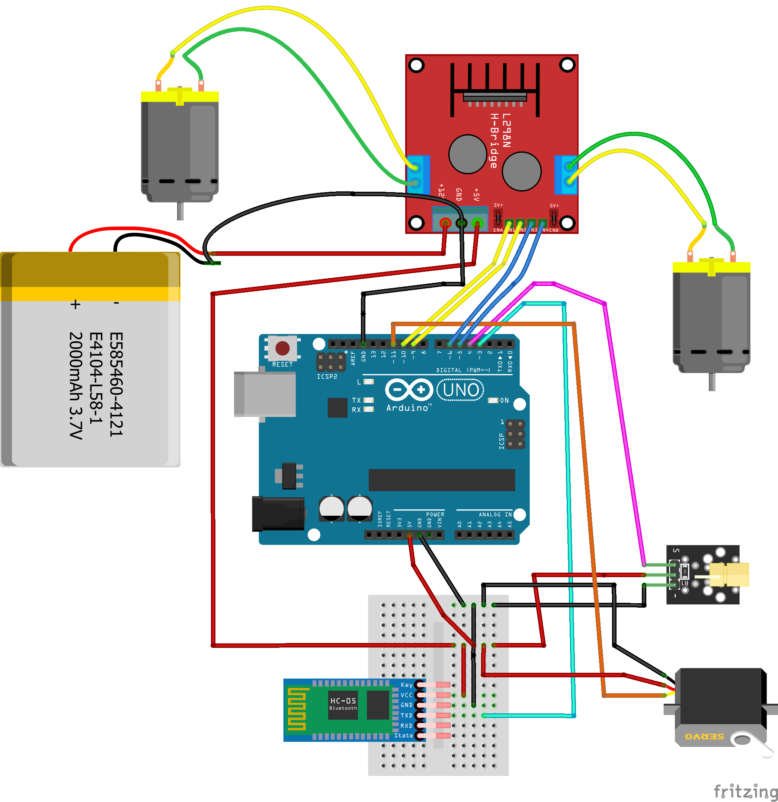

[<<<< Menu >>>>](../README.md)

# שיעור עשירי - החלפת הג'ויסטיק בבלוטות' 

<br><br>


### המעגל המלא:



### הקוד :

```cpp

#include <Servo.h>
#include <SoftwareSerial.h>
#define MAX_SPEED     255  //out of 255
#define MIN_SPEED     50   //out of 255

int m1_CW_Pin   = 5;      //  to motor's driver x 4
int m1_CCW_Pin  = 6;     //  
int m2_CW_Pin   = 9;      //
int m2_CCW_Pin  = 10;    //

int Laser_pin   = 4;       // to laser signal
int ServoFire_pin  = 11;  // to servo signal

Servo ServoFire; // create servo object for fire

#define SERVO_IDEL_ANGLE   0 
#define SERVO_FIRE_ANGLE   90 

// RX = 3, TX = 2 -  arduino RX <---> BT Tx
SoftwareSerial EEBlue(3, 2); 

void StopMotors()
{
  digitalWrite(m1_CW_Pin, LOW);
  digitalWrite(m1_CCW_Pin, LOW);
  digitalWrite(m2_CW_Pin, LOW);
  digitalWrite(m2_CCW_Pin, LOW);  
}

void TurnLaserOn()   {  digitalWrite(Laser_pin, HIGH);       Serial.println("Laser on...");    }

void TurnLaserOff()  {  digitalWrite(Laser_pin, LOW);        Serial.println("Laser off...");   }

void TriggerToIdle() {  ServoFire.write(SERVO_IDEL_ANGLE);   Serial.println("Trigger up...");  }
  
void TriggerToFire() {  ServoFire.write(SERVO_FIRE_ANGLE);   Serial.println("Trigger down (fire)..."); }

int isLeserOff() { return (digitalRead(Laser_pin) == LOW); }

void SetMotorSpeed(int cw_pin, int ccw_pin, int speed)
{
  if (speed > 0)
  {
    analogWrite(ccw_pin, 0); // Stop counterclockwise rotation
    analogWrite(cw_pin, speed); // Set clockwise rotation speed
  }
  else
  {
    analogWrite(cw_pin, 0);       // Stop clockwise rotation
    analogWrite(ccw_pin, -speed); // Set counterclockwise rotation speed
  }
}

void SetMotorsSpeed(int s1, int s2)
{
  SetMotorSpeed(m1_CW_Pin, m1_CCW_Pin, s1);
  SetMotorSpeed(m2_CW_Pin, m2_CCW_Pin, s2);
}


void setup() 
{
  Serial.begin(9600); 
  EEBlue.begin(9600); 

  pinMode(Laser_pin, OUTPUT);
  pinMode(m1_CW_Pin, OUTPUT);
  pinMode(m1_CCW_Pin, OUTPUT);
  pinMode(m2_CW_Pin, OUTPUT);
  pinMode(m2_CCW_Pin, OUTPUT);
  SetMotorsSpeed(0, 0);
  
  TurnLaserOff();

  ServoFire.attach(ServoFire_pin);          

  TriggerToIdle(); 
}

int Speed = 200;

void loop()
{
  if (EEBlue.available())
  {
    char bt_char = EEBlue.read();
    if (bt_char!='S')
      Serial.println(bt_char);

    if (isLeserOff()) // Don't move if laser is on !
    {
      if (bt_char == 'S') SetMotorsSpeed(   0,        0);  // Stop
      if (bt_char == 'F') SetMotorsSpeed(Speed,   Speed);  // Forward
      if (bt_char == 'B') SetMotorsSpeed(-Speed, -Speed);  // Backward
      if (bt_char == 'L') SetMotorsSpeed( Speed, -Speed);  // Left
      if (bt_char == 'R') SetMotorsSpeed(-Speed,  Speed);  // Right

      if (bt_char == 'G') SetMotorsSpeed(Speed,   0);  // Forward Left  
      if (bt_char == 'H') SetMotorsSpeed(-Speed,  0);  // Backward Left
      if (bt_char == 'I') SetMotorsSpeed(0,   Speed);  // Forward Right
      if (bt_char == 'J') SetMotorsSpeed(0, -Speed);  // Backward Right
    }
    if (bt_char == 'W')  TurnLaserOn();
    if (bt_char == 'w')  TurnLaserOff(); 
    
    if (bt_char == 'x')                   TriggerToIdle(); 
    if (bt_char == 'X' && !isLeserOff())  TriggerToFire(); // Fire only if the laser is on !

    if ((bt_char > '0') && (bt_char <= '9'))
    { 
      Speed = map(bt_char-'0', 0, 9, MIN_SPEED, MAX_SPEED);
      Serial.print("Speed selected: ");
      Serial.println(Speed);
    }
  }
}

```


<br><br><br><br><br><br><br><br><br><br><br><br><br><br>
<br><br><br><br><br><br><br><br><br><br><br><br><br><br>
<br><br><br><br><br><br><br><br><br><br><br><br><br><br>
<br><br><br><br><br><br><br><br><br><br><br><br><br><br>
<br><br><br><br><br><br><br><br><br><br><br><br><br><br>
<br><br><br><br><br><br><br><br><br><br><br><br><br><br>
<br><br><br><br><br><br><br><br><br><br><br><br><br><br>
<br><br><br><br><br><br><br><br><br><br><br><br><br><br>
<br><br><br><br><br><br><br><br><br><br><br><br><br><br>
<br><br><br><br><br><br><br><br><br><br><br><br><br><br>
<br><br><br><br><br><br><br><br><br><br><br><br><br><br>

### עוד למטה..... 


            |         |         |         |         |        
            |         |         |         |         |        
          \ | /     \ | /     \ | /     \ | /     \ | /        
           \|/       \|/       \|/       \|/       \|/         
            V         V         V         V         V        


<br><br><br><br><br><br><br><br><br><br><br><br><br><br>
<br><br><br><br><br><br><br><br><br><br><br><br><br><br>
<br><br><br><br><br><br><br><br><br><br><br><br><br><br>
<br><br><br><br><br><br><br><br><br><br><br><br><br><br>
<br><br><br><br><br><br><br><br><br><br><br><br><br><br>
<br><br><br><br><br><br><br><br><br><br><br><br><br><br>
<br><br><br><br><br><br><br><br><br><br><br><br><br><br>
<br><br><br><br><br><br><br><br><br><br><br><br><br><br>
<br><br><br><br><br><br><br><br><br><br><br><br><br><br>
<br><br><br><br><br><br><br><br><br><br><br><br><br><br>
<br><br><br><br><br><br><br><br><br><br><br><br><br><br>
<br><br><br><br><br><br><br><br><br><br><br><br><br><br>
<br><br><br><br><br><br><br><br><br><br><br><br><br><br>

### המעגל המלא:

