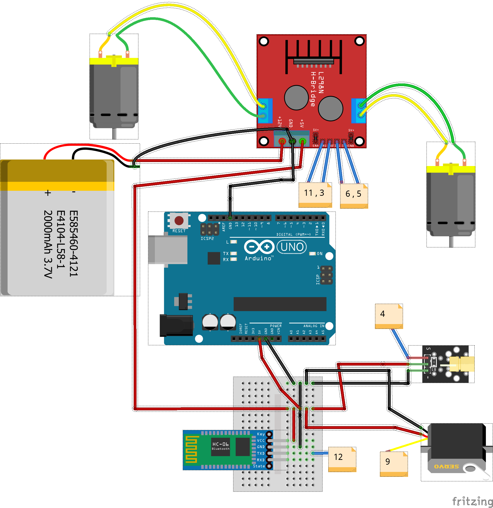

[<<<< Menu >>>>](../README.md)

# שיעור עשירי - החלפת הג'ויסטיק בבלוטות' 

<br><br>


### המעגל המלא:



### הקוד :

```cpp

#include <Servo.h>
#include <SoftwareSerial.h>

#define MAX_SPEED      255 
#define MIN_SPEED      50 

// Motor 1 (PWM pins 5 & 6) - Timer 0
int m1_CW_Pin   = 5;      
int m1_CCW_Pin  = 6;     

// Motor 2 (PWM pins 3 & 11) - Timer 2
int m2_CW_Pin   = 3;      
int m2_CCW_Pin  = 11;    

int Laser_pin   = 4;       
int ServoFire_pin  = 9; 

Servo ServoFire; 

#define SERVO_IDLE_ANGLE   0 
#define SERVO_FIRE_ANGLE   90 

SoftwareSerial EEBlue(12, 13); // RX = 12, TX = 13

void TurnLaserOn()   {  digitalWrite(Laser_pin, HIGH);       Serial.println("Laser on...");    }
void TurnLaserOff()  {  digitalWrite(Laser_pin, LOW);        Serial.println("Laser off...");   }

void TriggerToIdle() {  ServoFire.write(SERVO_IDLE_ANGLE);   Serial.println("Trigger up...");  }
void TriggerToFire() {  ServoFire.write(SERVO_FIRE_ANGLE);   Serial.println("Trigger down (fire)..."); }

int isLaserOff() { return (digitalRead(Laser_pin) == LOW); }

void SetMotorSpeed(int cw_pin, int ccw_pin, int speed)
{
  if (speed > 0)
  {
    analogWrite(ccw_pin, 0); 
    analogWrite(cw_pin, speed); 
  }
  else
  {
    analogWrite(cw_pin, 0);       
    analogWrite(ccw_pin, -speed); 
  }
}

void SetMotorsSpeed(int s1, int s2)
{
  SetMotorSpeed(m1_CW_Pin, m1_CCW_Pin, s1);
  SetMotorSpeed(m2_CW_Pin, m2_CCW_Pin, s2);
}

void setup() 
{
  Serial.begin(9600); 
  EEBlue.begin(9600); 

  pinMode(Laser_pin, OUTPUT);
  pinMode(m1_CW_Pin, OUTPUT);
  pinMode(m1_CCW_Pin, OUTPUT);
  pinMode(m2_CW_Pin, OUTPUT);
  pinMode(m2_CCW_Pin, OUTPUT);
  
  SetMotorsSpeed(0, 0);
  TurnLaserOff();

  ServoFire.attach(ServoFire_pin);           
  TriggerToIdle(); 
}

int Speed = 200;

void loop()
{
  if (EEBlue.available())
  {
    char bt_char = EEBlue.read();
    if (bt_char!='S') Serial.println(bt_char);

    // Fixed spelling typo
    if (isLaserOff()) 
    {
      if (bt_char == 'S') SetMotorsSpeed(   0,         0);  
      if (bt_char == 'F') SetMotorsSpeed(Speed,    Speed);  
      if (bt_char == 'B') SetMotorsSpeed(-Speed, -Speed);  
      if (bt_char == 'L') SetMotorsSpeed( Speed, -Speed);  
      if (bt_char == 'R') SetMotorsSpeed(-Speed,  Speed);  

      if (bt_char == 'G') SetMotorsSpeed(Speed,    0);  
      if (bt_char == 'H') SetMotorsSpeed(-Speed,   0);  
      if (bt_char == 'I') SetMotorsSpeed(0,    Speed);  
      if (bt_char == 'J') SetMotorsSpeed(0,   -Speed);  
    }
    
    if (bt_char == 'W')  TurnLaserOn();
    if (bt_char == 'w')  TurnLaserOff(); 
    
    if (bt_char == 'x')                   TriggerToIdle(); 
    if (bt_char == 'X' && !isLaserOff())  TriggerToFire(); 

    // Changed > '0' to >= '0' to include 0
    if ((bt_char >= '0') && (bt_char <= '9'))
    { 
      Speed = map(bt_char-'0', 0, 9, MIN_SPEED, MAX_SPEED);
      Serial.print("Speed selected: ");
      Serial.println(Speed);
    }
  }
}

```


<br><br><br><br><br><br><br><br><br><br><br><br><br><br>
<br><br><br><br><br><br><br><br><br><br><br><br><br><br>
<br><br><br><br><br><br><br><br><br><br><br><br><br><br>
<br><br><br><br><br><br><br><br><br><br><br><br><br><br>
<br><br><br><br><br><br><br><br><br><br><br><br><br><br>
<br><br><br><br><br><br><br><br><br><br><br><br><br><br>
<br><br><br><br><br><br><br><br><br><br><br><br><br><br>
<br><br><br><br><br><br><br><br><br><br><br><br><br><br>
<br><br><br><br><br><br><br><br><br><br><br><br><br><br>
<br><br><br><br><br><br><br><br><br><br><br><br><br><br>
<br><br><br><br><br><br><br><br><br><br><br><br><br><br>

### עוד למטה..... 


            |         |         |         |         |        
            |         |         |         |         |        
          \ | /     \ | /     \ | /     \ | /     \ | /        
           \|/       \|/       \|/       \|/       \|/         
            V         V         V         V         V        


<br><br><br><br><br><br><br><br><br><br><br><br><br><br>
<br><br><br><br><br><br><br><br><br><br><br><br><br><br>
<br><br><br><br><br><br><br><br><br><br><br><br><br><br>
<br><br><br><br><br><br><br><br><br><br><br><br><br><br>
<br><br><br><br><br><br><br><br><br><br><br><br><br><br>
<br><br><br><br><br><br><br><br><br><br><br><br><br><br>
<br><br><br><br><br><br><br><br><br><br><br><br><br><br>
<br><br><br><br><br><br><br><br><br><br><br><br><br><br>
<br><br><br><br><br><br><br><br><br><br><br><br><br><br>
<br><br><br><br><br><br><br><br><br><br><br><br><br><br>
<br><br><br><br><br><br><br><br><br><br><br><br><br><br>
<br><br><br><br><br><br><br><br><br><br><br><br><br><br>
<br><br><br><br><br><br><br><br><br><br><br><br><br><br>

### המעגל המלא:

